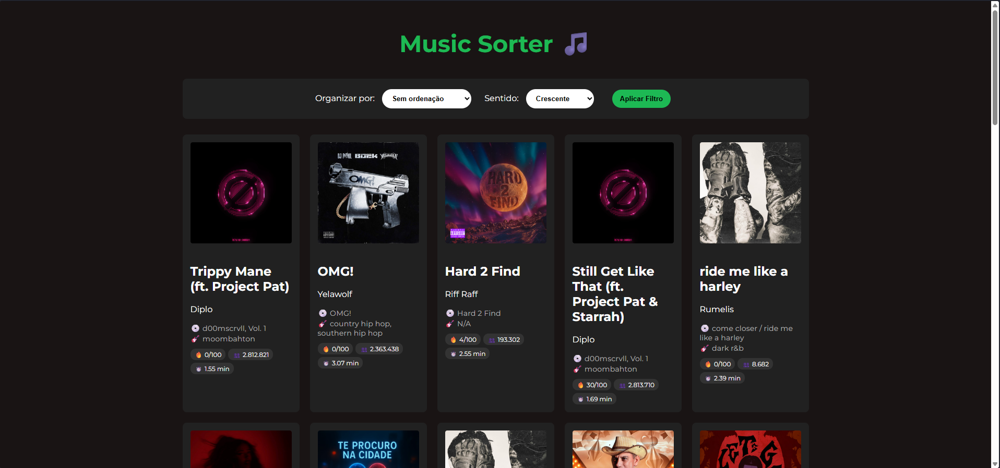
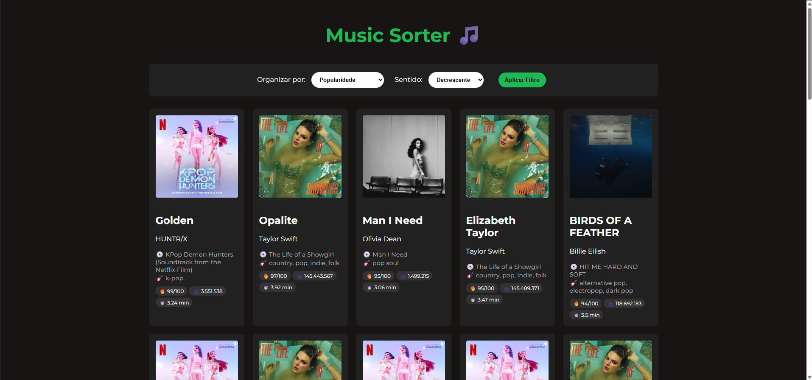
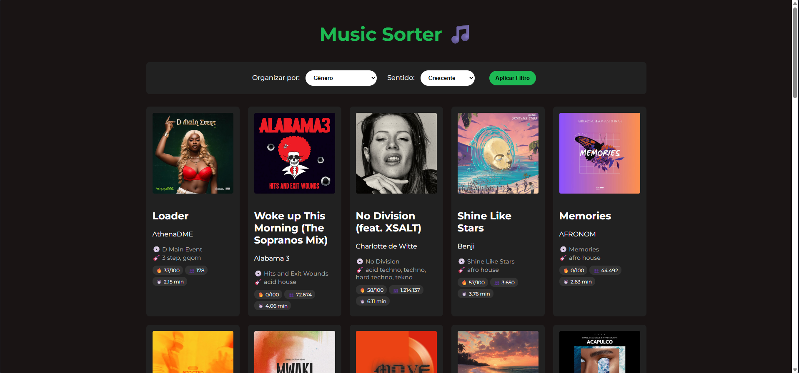

# Music Sorter

Número da Lista: 19<br>
Conteúdo da Disciplina: Algoritmos de Ordenação<br>

## Alunos
|Matrícula | Aluno |
| -- | -- |
| 21/1061860 | Henrique Martins Alencar |

## Vídeo de Apresentação

* https://youtu.be/0JFw_fYvGWQ

## Sobre 

Esse projeto tem como objetivo aplicar algoritmos de ordenação em uma base de dados de músicas do Spotify. O site mostra o catálogo de músicas e permite que o usuário aplique filtros, realizando a ordenação através dos algoritmos: **Counting Sort**, **Radix Sort** e **Merge Sort**.

## Screenshots

### Página Inicial



### Ordenação por Seguidores



### Ordenação por Gênero



## Instalação 
Linguagem: Python, HTML, CSS<br>
Framework: Flask e Spotipy <br>

### Pré-requisitos:

* Python 3.x

* Pip.

### Instalação e execução:

* Clone este repositório:

```bash
git clone https://github.com/eda2-2026/G19_Ordenacao_EDA2-2026.1
cd G19_Ordenacao_EDA2-2026.1
```

* Instale as dependências:

```bash
pip install flask spotipy python-dotenv
```

* Execute o servidor local:

```bash
python app.py
```

## Uso 

* Acesse o endereço: http://127.0.0.1:5000
* Escolha a categoria de ordenação;
* Escolha o sentido (crescente/decrescente);
* Clique em aplicar;
* O site mostrará as músicas ordenadas pelo filtro inserido.
